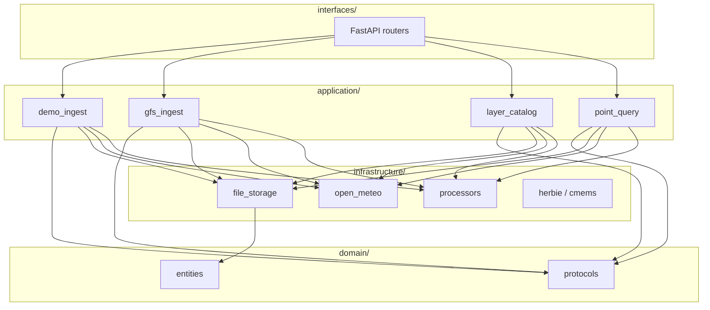
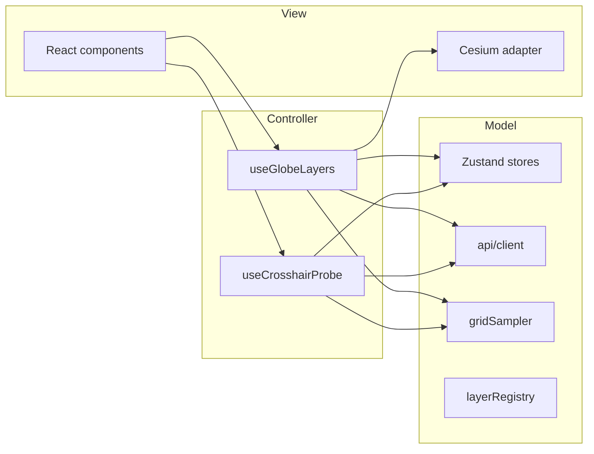

# 技术架构 · 3D 地球气象可视化

> **维护者**：架构师。变更主栈或目录结构须架构师批准并更新本文档。

## 1. 总览

| 层级 | 技术 | 路径 |
|------|------|------|
| 前端 | Vite + React 18 + TypeScript + CesiumJS | `apps/web/` |
| 状态 | Zustand + TanStack Query | `apps/web/src/stores/` |
| 后端 | FastAPI + Uvicorn | `services/api/` |
| GFS | Herbie + cfgrib + xarray | `services/api/app/infrastructure/` |
| 海洋 | copernicusmarine | `services/api/app/infrastructure/` |
| 存储 | 本地 `data/processed/`（MVP） | `data/` |

## 2. 分层架构

### 后端（Clean Architecture）



| 层 | 职责 | 路径 |
|----|------|------|
| **domain** | 实体、图层 ID、`GridRepository` / `WeatherDataSource` 协议 | `app/domain/` |
| **application** | 用例：演示摄取、GFS 摄取、资产清单、点查询 | `app/application/` |
| **infrastructure** | Herbie、文件存储、Open-Meteo、xarray RAII、预处理 | `app/infrastructure/` |
| **interfaces** | FastAPI 路由（薄层，委托 application） | `app/interfaces/routers/` → `app/routers/` |

旧路径 `app/process/`、`app/services/` 保留 **兼容 re-export**，新代码请写入上述分层目录。

### 前端（MVC 风格）



| 层 | 路径 |
|----|------|
| **Model** | `stores/`、`api/`、`services/gridSampler.ts`、`config/layerRegistry.ts` |
| **View** | `components/`（纯展示）、`cesium/`（Viewer 适配） |
| **Controller** | `controllers/` hooks，连接 Viewer 事件与 Model |

## 3. 数据流

```
NOAA GFS (Herbie) ──┐
                    ├──► processors ──► data/processed/{valid_time}/
Demo generators  ───┘         │
                              ▼
                       FastAPI /assets + /query
                              │
                              ▼
              Cesium 图层 + 十字准星 HUD（网格双线性采样）
```

## 4. 预处理产物

| 图层 ID | 文件 | 说明 |
|---------|------|------|
| `temperature` | `temperature.png` + `temperature.meta.json` + `temperature.grid.bin` | 2m 气温纹理 + 可采样网格 |
| `terrain_contours` | `terrain_contours.geojson` | 地势海拔等高线（非气压） |
| `wind` | `wind.uv.json` + `wind.uv.bin` | U/V 规则网格（float32） |
| `ocean` | `ocean.uv.json` + `ocean.uv.bin` | 洋流 U/V |

## 5. API 契约

| 方法 | 路径 | 说明 |
|------|------|------|
| GET | `/health` | 健康检查 |
| GET | `/layers/catalog` | 图层元数据列表 |
| GET | `/times` | 可用 `valid_time` ISO8601 列表 |
| GET | `/times/manifest` | 时次元数据（含 `source`） |
| GET | `/assets/{valid_time}/{layer_id}` | 资产清单（URL 相对路径） |
| GET | `/query/temperature` | 点查询：网格双线性 → Open-Meteo 回退 |
| POST | `/ingest/demo` | 生成演示数据（开发用） |
| POST | `/ingest/gfs` | 触发 GFS 摄取（需网络与 cfgrib） |
| POST | `/ingest/cmems` | 触发 CMEMS 摄取（需凭据） |

### 点查询示例

```json
GET /query/temperature?lat=31.23&lon=121.47&valid_time=2026-05-23T12:00:00Z
{
  "lat": 31.23,
  "lon": 121.47,
  "temp_c": 18.4,
  "source": "demo"
}
```

## 6. 十字准星与气温探测

1. **主路径**：前端 `gridSampler` 加载 `temperature.grid.bin`，对当前 `valid_time` 做 **双线性采样**（与 overlay 同源）。
2. **回退**：网格不可用时，后端 `/query/temperature` 调用 **Open-Meteo**（速率限制 2s/次，见 README）。
3. **禁止**：爬取第三方气象网站 HTML（AGENTS.md）。

## 7. 图层注册表（可扩展）

前端 `config/layerRegistry.ts` 驱动 `LayerPanel` 与图层工厂；新增图层时：

1. 在 `domain/entities.LAYER_FILES` 增加产物映射
2. 在 `layerRegistry.ts` 注册 UI 条目
3. 在 `controllers/useGlobeLayers.ts` 增加 loader（或通用 factory）

## 8. 环境变量

见根目录 `.env.example`：`VITE_CESIUM_ION_TOKEN`、`VITE_API_BASE_URL`、`CMEMS_*`、`GFS_*`、`DATA_DIR`。

## 9. 代码规范（架构师制定）

- TypeScript：`strict` 开启；组件函数式 + hooks
- Python：类型注解；依赖倒置（protocols）；xarray 使用 `infrastructure/xarray_context.py`
- 禁止在业务代码中硬编码密钥
- 图层 ID 枚举（地图 MVP）：`basemap` | `terrain` | `hillshade` | `roads`（前端 `layerRegistry.ts`）；遗留气象资产 ID 仍见 `domain/entities.py`
- 业务 colormap：须 **美术设计师** 规格（当前气温 **coolwarm -40~40°C**）

## 10. 性能目标

- 粒子数 1e4–5e4，目标 60fps（GPU Primitive）
- 仅保留最近 2–3 个 `valid_time` 的处理结果
- 十字准星探测 debounce 80ms，Open-Meteo 限速 2s

## 11. 风险

| 风险 | 对策 |
|------|------|
| GRIB 体积大 | subset 单层变量；降采样 0.25° |
| Herbie 离线失败 | `POST /ingest/demo` 演示数据 |
| 旧目录仅有 `isobars.geojson` | 启动时 `repair_existing_times()` 迁移 |
| Copernicus 配额 | 夜间批处理；前端只读已处理资产 |

## 12. MVP 验收

- 3D 地球可旋转缩放
- 四图层独立开关（默认全开便于验收）
- 十字准星 + lat/lon + 气温 + source 显示
- 数据来自 GFS/CMEMS/演示管线（非爬虫），展示署名与 `valid_time`
- 时间轴 ≥2 时次
