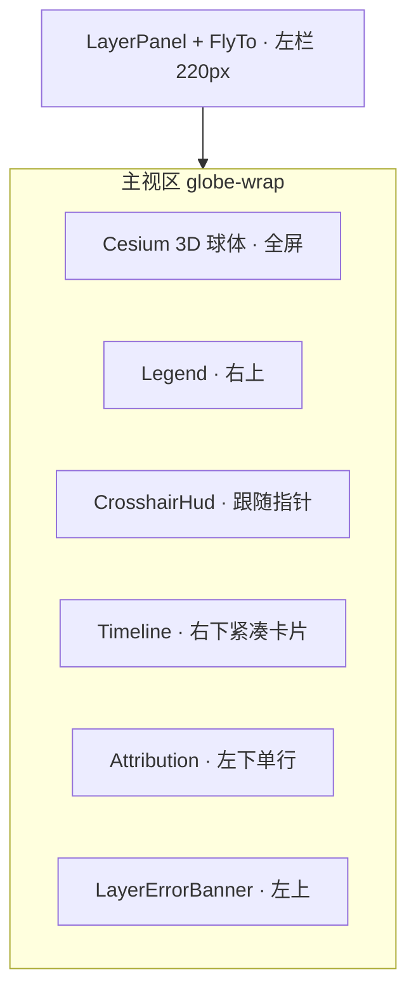

# 3D 地球气象可视化 · UI 设计规格

> 角色：美术设计师交付 · 前端实现参考  
> 版本：0.2 · 2026-05-23

## 1. 设计目标

- **全屏沉浸**：Cesium 球体占满主视区，控件以半透明面板浮于其上。
- **暗色专业**：深蓝灰背景 + 高对比文字，适配 Esri 影像底图与 coolwarm 气温填色。
- **可读优先**：图例、HUD、预报时次互不遮挡；关键数值 ≥ WCAG AA 对比度。

## 2. 布局线框



ASCII 示意（1920×1080）：

```
┌──────────┬────────────────────────────────────────────────┐
│ Layer    │  [错误条]              [气温图例]              │
│ Panel    │                                                │
│ FlyTo    │              3D 地球 + 图层                    │
│          │         ╋ 十字准星 + HUD 卡片                  │
│          │ [署名单行]              [预报时次 · 右下]      │
└──────────┴────────────────────────────────────────────────┘
```

| 区域 | 位置 | z-index | 说明 |
|------|------|---------|------|
| 球体 | `inset: 0` | 0 | Cesium 容器 |
| LayerErrorBanner | 左上 12px | 12 | 图层加载失败 |
| Legend | 右上 12px | 11 | 仅气温图层开启且有 range 时显示 |
| Timeline | **右下** 12px | 11 | 宽 ≤360px 紧凑卡片 |
| Attribution | 左下 12px | 10 | compact 单行，不单独占整行底栏 |
| Crosshair HUD | 指针 +18px | 21 | 固定十字线 viewport z20 |

## 3. 组件清单

| 组件 | 路径 | 职责 |
|------|------|------|
| **LayerPanel** | `apps/web/src/components/LayerPanel.tsx` | 图层开关、多源/网页选项、图层 ⚠ 提示 |
| **Timeline** | `apps/web/src/components/Timeline.tsx` | 预报时次选择、当前/±Nh 标签 |
| **CrosshairOverlay** | `apps/web/src/components/CrosshairOverlay.tsx` | 十字线 + HUD（点探针 / 区域模式） |
| **Legend** | `apps/web/src/components/Legend.tsx` | coolwarm 色标与 min/max |
| **Attribution** | `apps/web/src/components/Attribution.tsx` | 数据许可、底图来源、valid_time |
| **EarthGlobe** | `apps/web/src/components/EarthGlobe.tsx` | Viewer 生命周期、图层控制器挂载 |
| **FlyToPanel** | `apps/web/src/components/FlyToPanel.tsx` | 经纬度飞行 |
| **LayerErrorBanner** | `apps/web/src/components/LayerErrorBanner.tsx` | 聚合 `layerErrorStore` |

控制器（非 UI）：`useGlobeLayers`、`useRegionalView`、`useCrosshairProbe` — 见 `layerRegistry.ts`。

## 4. Design Tokens

### 4.1 色板（暗色 UI）

| Token | 值 | 用途 |
|-------|-----|------|
| `--color-bg-app` | `#0b1020` | 应用背景 |
| `--color-panel-bg` | `rgba(12, 18, 36, 0.92)` | 面板底色 |
| `--color-panel-border` | `rgba(255,255,255,0.08)` | 面板描边 |
| `--color-text-primary` | `#e8ecf4` | 主文字 |
| `--color-accent` | `#38bdf8` | 选中芯片、链接 |
| `--color-accent-soft` | `#7dd3fc` | Attribution 强调 |
| `--color-success` | `#86efac` | 高置信 / 「当前」徽章 |
| `--color-warn` | `#fbbf24` | 演示数据、最近可用提示 |
| `--color-danger` | `#f87171` | 错误、低置信 |
| `--color-crosshair` | `#22d3ee` | 十字线 |
| `--color-crosshair-dot` | `#fef08a` | 中心点 |
| `--color-region-highlight` | `YELLOW α0.28` | 区域高亮填充 |

### 4.2 气温填色（业务 colormap）

- **色标名**：matplotlib `coolwarm`
- **固定范围**：-40°C ~ +40°C（`temperature.meta.json` 中 `color_scale_min_c` / `color_scale_max_c`）
- **图例渐变**：`#2166ac`（冷）→ `#f7f7f7`（中）→ `#b2182b`（暖）— 与 `Legend` CSS 一致
- **Imagery alpha**：0.82（叠加 Esri 底图）

### 4.3 底图

- **首选**：Cesium Ion（需有效 `VITE_CESIUM_ION_TOKEN`）
- **回退**：Esri World Imagery（无 Token）— 与 `createViewer.ts` 一致

### 4.4 字体与圆角

| Token | 值 |
|-------|-----|
| 面板圆角 | `8px` |
| 芯片圆角 | `4px` |
| 面板字号 | `0.9rem` / 标题 `1rem` |
| HUD 气温 | `1.05rem` bold |
| 署名 compact | `0.68rem` |

## 5. 交互流程

### 5.1 切换图层

1. 用户在 **LayerPanel** 勾选/取消 `layerRegistry` 中的图层 id。
2. `useGlobeLayers` / `useRegionalView` 监听 `layerStore.layers` 与 `currentTime`。
3. 失败 → `layerErrorStore` → **LayerErrorBanner** + 面板 ⚠。

### 5.2 悬停区域（区域视图）

1. 开启 **区域视图** → 加载 GeoJSON 边界 → `useRegionalHud: true`。
2. `MOUSE_MOVE` → 防抖 100ms → `GET /weather/region`。
3. 返回 `region_id` → `highlightRegion` 高亮 polygon。
4. HUD 显示「区域平均气温」与 `regionNameZh`。

### 5.3 切换预报时次

1. 启动：`GET /times` → **选取距 UTC 现在最近的 valid_time**。
2. 无时次 → 自动 `POST /ingest/demo`。
3. **Timeline** 右下：芯片或滑块切换；徽章 **当前** / **+Nh 预报** / **最近可用**。
4. `currentTime` 变化 → 已启用图层并行刷新资产。

### 5.4 十字准星（非区域模式）

- 默认 **多源校验**：`/weather/point/multi`，共识气温 + 置信度色。
- 关闭多源：网格双线性 → 单源 API。

## 6. 状态设计

| 状态 | 表现 |
|------|------|
| **加载中** | 球体空白；Times 空列表时顶部橙条「正在生成演示数据…」 |
| **错误** | 左上红底 LayerErrorBanner；面板 ⚠ |
| **演示数据** | Attribution `演示合成数据`；Timeline「最近可用预报」黄字 |
| **真实 GFS** | Attribution `NOAA GFS 真实预报数据` |
| **无后端** | 橙条「无法连接后端 API」 |
| **当前时次** | Timeline 绿色徽章「当前」（±45min 内） |

## 7. 图层注册表扩展（layerRegistry）

新增图层步骤：

1. 在 `config/layerRegistry.ts` 增加 `LayerRegistryEntry`（`id` / `type` / `defaultVisible`）。
2. `stores/layerStore.ts` 的 `LayerId` 联合类型同步扩展。
3. 后端 `LAYER_FILES` + 摄取/处理管道产出资产。
4. `useGlobeLayers` 或专用 hook 中 `syncLayer` 分支。
5. 若涉及 colormap/图例 → **美术设计师** 更新本文档 §4.2 与 `Legend`。

## 8. 无障碍（a11y）

- Timeline：`role="group"` + `aria-label="预报时次"`；滑块 `aria-valuetext` 含徽章文案。
- HUD：`role="status"` + `aria-live="polite"`。
- 错误：`role="alert"`。
- 对比：HUD 文字 `#e2e8f0` on `rgba(12,18,36,0.94)`；置信度高/中/低用绿/黄/红区分（非唯一信息载体，辅以文案）。

## 9. 相关文档

- 组件索引：[COMPONENTS.md](./COMPONENTS.md)
- 协作角色：`.cursor/rules/designer.mdc`
- 架构：`docs/ARCHITECTURE.md`
