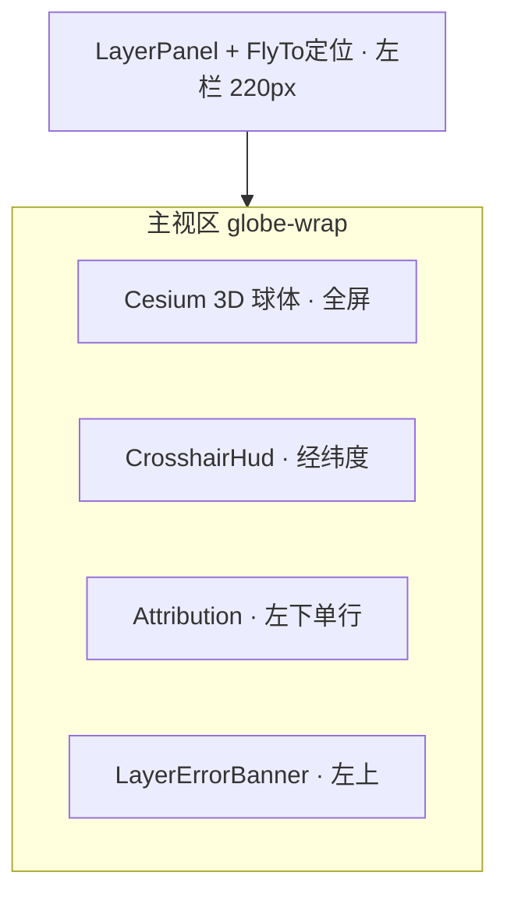

# 3D 地球地图可视化 · UI 设计规格

> 角色：美术设计师交付 · 前端实现参考  
> 版本：0.3 · 2026-05-23

## 1. 设计目标

- **全屏沉浸**：Cesium 球体占满主视区，控件以半透明面板浮于其上。
- **暗色专业**：深蓝灰背景 + 高对比文字，适配 OSM 浅色底图与 hillshade 叠加。
- **可读优先**：HUD、署名互不遮挡；关键文字 ≥ WCAG AA 对比度。

## 2. 布局线框

| 区域 | 位置 | z-index | 说明 |
|------|------|---------|------|
| 球体 | `inset: 0` | 0 | Cesium 容器 |
| LayerErrorBanner | 左上 12px | 12 | 图层加载失败 |
| Attribution | 左下 12px | 10 | compact 单行 |
| Crosshair HUD | 指针 +18px | 21 | 仅经纬度 |

## 3. 组件清单

| 组件 | 路径 | 职责 |
|------|------|------|
| **LayerPanel** | `LayerPanel.tsx` | 底图 / 地形 / 着色 / 路网开关 |
| **FlyToPanel** | `FlyToPanel.tsx` | 经纬度定位飞行 |
| **CrosshairOverlay** | `CrosshairOverlay.tsx` | 十字线 + 经纬度 HUD |
| **Attribution** | `Attribution.tsx` | OSM / Esri / 地形署名 |
| **EarthGlobe** | `EarthGlobe.tsx` | Viewer + `useMapLayers` |
| **LayerErrorBanner** | `LayerErrorBanner.tsx` | 聚合图层错误 |

控制器：`useMapLayers`、`useCrosshairProbe` — 见 `layerRegistry.ts`。

## 4. Design Tokens

### 4.1 色板（暗色 UI）

与 `App.css` 一致：`#0b1020` 背景、面板 `rgba(12,18,36,0.92)`、强调 `#38bdf8`、十字线 `#22d3ee`。

### 4.2 底图与叠加

| 图层 id | 实现 |
|---------|------|
| `basemap` | OSM `tile.openstreetmap.org` |
| `terrain` | Cesium World Terrain（Ion）或椭球 |
| `hillshade` | Esri World Hillshade，alpha ≈ 0.55 |
| `roads` | OSM France HOT，alpha ≈ 0.42 |

### 4.3 字体与圆角

面板圆角 `8px`；HUD 坐标 `0.9rem`；署名 compact `0.68rem`。

## 5. 交互流程

### 5.1 切换图层

1. **LayerPanel** 勾选 → `layerStore.layers`。
2. `useMapLayers` 更新 imagery / terrain。
3. 失败 → `layerErrorStore` → Banner + 面板 ⚠。

### 5.2 十字准星

- `MOUSE_MOVE` → 椭球/地形拾取 → HUD 显示 lat/lon（4 位小数）。
- 无气温、无多源、无区域模式。

### 5.3 定位

- **FlyToPanel** 输入纬度/经度/高度 → `camera.flyTo` + 地面标记点。

## 6. 图层注册表

`config/layerRegistry.ts`：`basemap` | `terrain` | `hillshade` | `roads`。

新增图层须同步 `layerStore`、后端 `/layers/catalog`、`useMapLayers`。

## 7. 无障碍

- HUD：`role="status"` + `aria-live="polite"`。
- 错误：`role="alert"`。

## 8. 相关文档

- [COMPONENTS.md](./COMPONENTS.md)
- [docs/ARCHITECTURE.md](../ARCHITECTURE.md)
